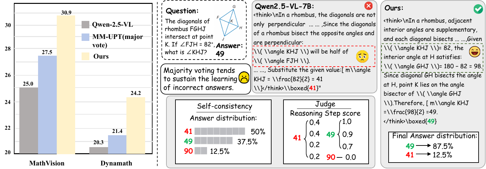

<div align="center">

# ⚖️ When Models Judge Themselves
###  Unsupervised Self-Evolution for Multimodal Reasoning

<!-- [](https://arxiv.org/abs/2509.25541)
[](LICENSE)
[](https://huggingface.co/Qinsi1) -->




*An unsupervised self-evolution training framework for multimodal reasoning that achieves stable performance improvements without using human-annotated answers or external reward models.*

</div>

## 📋 Table of Contents

- [🧭 Overview](#-overview)
- [📊 Performance Results](#-performance-results)
- [🚀 Quick Start](#-quick-start)
- [🤖 Models](#-models)
- [🤝 Acknowledgements](#-acknowledgements)
- [📊 Evaluation](#-evaluation)
- [📄 Citation](#-citation)

---

## 🧭 Overview

Although recent post-training methods have shown promising results in improving multimodal reasoning, most existing approaches still rely on strong supervision or simplified pseudo-labels, which can amplify model biases and lead to unstable training dynamics.

To address this challenge, *we propose an unsupervised self-evolution framework that improves multimodal reasoning by collaboratively modeling self-consistency and Judge-based evaluation at the group level, without using any human annotations or external reward models*.

> 🏆 **Achievement:** our method achieves consistent and stable performance gains across multiple multimodal reasoning benchmarks.

---

## 📊 Performance Results

### 🧮 Unsupervised Training on MMR1

| Method | MathVision | MathVerse | WeMath | LogicVista | DynaMath | Avg. |
|------|------------|-----------|--------|------------|----------|------|
| Qwen2.5-VL-7B (Baseline) | 25.0 | 44.2 | 37.1 | 46.3 | 20.3 | 34.6 |
| Major Vote (MM-UPT) | 26.4 | 46.0 | 38.6 | 47.9 | 21.8 | 36.1 |
| **Ours (Actor–Judge)** | **28.4** | **46.4** | **38.8** | **48.6** | **23.0** | **37.0** |

> **Key Observation:**  
> On MMR1, our Actor–Judge framework consistently outperforms majority-vote-based self-evolution, achieving a **+2.4 average accuracy gain** over the baseline while maintaining stable training dynamics.

### 📐 Unsupervised Training on GeoQA

| Method | MathVision | MathVerse | WeMath | LogicVista | DynaMath | Avg. |
|------|------------|-----------|--------|------------|----------|------|
| Qwen2.5-VL-7B (Baseline) | 25.0 | 44.2 | 37.1 | 46.3 | 20.3 | 34.6 |
| Major Vote (MM-UPT) | 27.3 | 45.1 | 38.2 | 47.3 | 21.9 | 36.0 |
| **Ours (Actor–Judge)** | **28.6** | **46.5** | **38.9** | **47.9** | **23.2** | **37.0** |

> **Key Observation:**  
> Training on GeoQA further highlights the limitations of single-scalar pseudo-labels.  
> Our method improves performance across **all five benchmarks**, demonstrating stronger generalization to diverse mathematical reasoning tasks.


### 📏 Unsupervised Training on Geo3K

| Method | MathVision | MathVerse | WeMath | LogicVista | DynaMath | Avg. |
|------|------------|-----------|--------|------------|----------|------|
| Qwen2.5-VL-7B (Baseline) | 25.0 | 44.2 | 37.1 | 46.3 | 20.3 | 34.6 |
| Major Vote (MM-UPT) | 27.5 | 44.0 | 37.4 | 46.9 | 21.4 | 35.4 |
| **Ours (Actor–Judge)** | **30.9** | **46.8** | **38.7** | **49.0** | **24.2** | **37.9** |

> **Key Observation:**  
> When trained on Geo3K, our method achieves its strongest gains, with a **+5.9 absolute improvement on MathVision** and a **+3.3 average gain** over the baseline, surpassing prior unsupervised self-evolving methods by a clear margin.

---

### ✨ Key Features

<details>
<summary><b>🧩 Self-Consistency as a Training Prior</b></summary>

Our framework samples multiple reasoning trajectories for the same input and uses their agreement patterns to construct a self-consistency distribution. This provides a noise-reduced training prior in fully unsupervised settings, without relying on ground-truth answers or external supervision.

</details>

<details>
<summary><b>⚖️ Bounded Judge-Based Modulation</b></summary>

We introduce a frozen Judge that evaluates each reasoning trajectory and produces a bounded, continuous modulation signal. Instead of acting as an absolute reward, the Judge softly reshapes the Actor’s self-consistency distribution, correcting systematic biases while avoiding unstable optimization.

</details>

<details>
<summary><b>📊 Group-Wise Distributional Optimization</b></summary>

Rather than optimizing trajectories independently, we model rewards in a group-wise, distributional manner. By converting absolute scores into relative advantages within each input group, our approach prevents early mode collapse and enables stable, long-term self-evolution.

</details>


### 🚧 TODO

- [✅] Release the arXiv paper  
- [ ] Open-source the training code and hyperparameters  
- [ ] Release pretrained model checkpoints

---

## 🚀 Quick Start
#### Step 1: 🛠️ Environment Setup

```bash
# 1. Clone the repository
git clone https://github.com/xxxxxxx/xxxxxxx.git
cd evovlm

# 2. Set up environment
conda create -n evovlm python=3.10
conda activate evovlm
pip install -r requirements.txt
pip install -e.

```

#### Step 2: 🧩 Data Construction
Download the raw [Geo3K](https://huggingface.co/datasets/xxxxx/Geo3K) dataset.

Then, process the raw dataset using `data/geo3k.py` to generate the training inputs.

```bash
python data/geo3k.sh
```
<!-- The same procedure applies to the [GeoQA](https://huggingface.co/datasets/xxxxx/GeoQA) and [MMR1](https://huggingface.co/datasets/xxxxx/MMR1) datasets.


Alternatively, you can directly download our processed [Geo3K](https://huggingface.co/datasets/xxxxx/Geo3K), [GeoQA](https://huggingface.co/datasets/xxxxx/GeoQA), and [MMR1](https://huggingface.co/datasets/xxxxx/MMR1) datasets for training. -->

Training data will be released soon.

#### Step 3: ⚙️ Configuration
To start training, update the configuration in `run_qwen2_5_vl-evovlm.sh` by modifying the relevant arguments.

Configure your training setup in `run_qwen2_5_vl-evovlm.sh`:

```bash
# Configuration variables
TRAIN_FILE="/path/to/train.parquet"            # Training dataset (parquet)
VAL_FILE="/path/to/val_or_test.parquet"        # Validation / test dataset (parquet)
QWEN25_VL_MODEL_PATH="/path/to/Qwen2.5-VL-7B-Instruct"  # Qwen2.5-VL model directory
WANDB_PROJECT="Self-Judge"                         # trainer.project_name (wandb project)
WANDB_EXPERIMENT="qwen2_5_vl-Self-judge"           # trainer.experiment_name (wandb run name)
```


#### Step 4: 🚀 Start Training

Launch the training process with customizable hyperparameters:

```bash
bash examples/run_qwen2_5_vl-evovlm.sh
```


## 🤖 Models

### 🔬 Trained Models

Coming soon!

<!-- | Model Family | Size | Dataset | HuggingFace Link |
|--------------|------|---------|------------------|
| **Qwen2.5-VL** | 7B | Geo3K | [](https://huggingface.co/Qinsi1/Vision-Zero-Qwen-2.5-VL-7B-Clevr) |
| **Qwen2.5-VL** | 7B | GeoQA | [](https://huggingface.co/Qinsi1/Vision-Zero-Qwen-2.5-VL-7B-Chart) |
| **Qwen2.5-VL** | 7B | MMR1 | [](https://huggingface.co/Qinsi1/Vision-Zero-Qwen-2.5-VL-7B-RealWorld) | -->


## 🤝 Acknowledgements

> 📢 **Acknowledgment:** Our codebase is built upon the [Verl](https://github.com/volcengine/verl) framework, and we thank the authors for their valuable contributions to the community！


---

## 📊 Evaluation

We use [VLMEvalKit](https://github.com/open-compass/VLMEvalKit) as the evaluation framework for all models, and all evaluations are conducted within this framework. We thank the authors for their valuable contributions to the community.

Since many benchmarks provide open-ended or non-multiple-choice answers, we follow the official evaluation protocols and employ an answer extraction model to extract the final answers. To ensure fair comparison, all methods use the same answer extraction model. We adopt [Kimi-K2] as the answer extraction model.


---

## 📄 Citation

If you find our paper is useful in your research, please consider citing our paper:

<!-- ```bibtex
@misc{wu2025dagaitgeneralizedskeletonguideddata,
      title={DAGait: Generalized Skeleton-Guided Data Alignment for Gait Recognition}, 
      author={Zhengxian Wu and Chuanrui Zhang and Hangrui Xu and Peng Jiao and Haoqian Wang},
      year={2025},
      eprint={2503.18830},
      archivePrefix={arXiv},
      primaryClass={cs.CV},
      url={https://arxiv.org/abs/2503.18830}, 
}
```

--- -->

<div align="center">

**🌟 Star this repo if you find it helpful!**


</div>